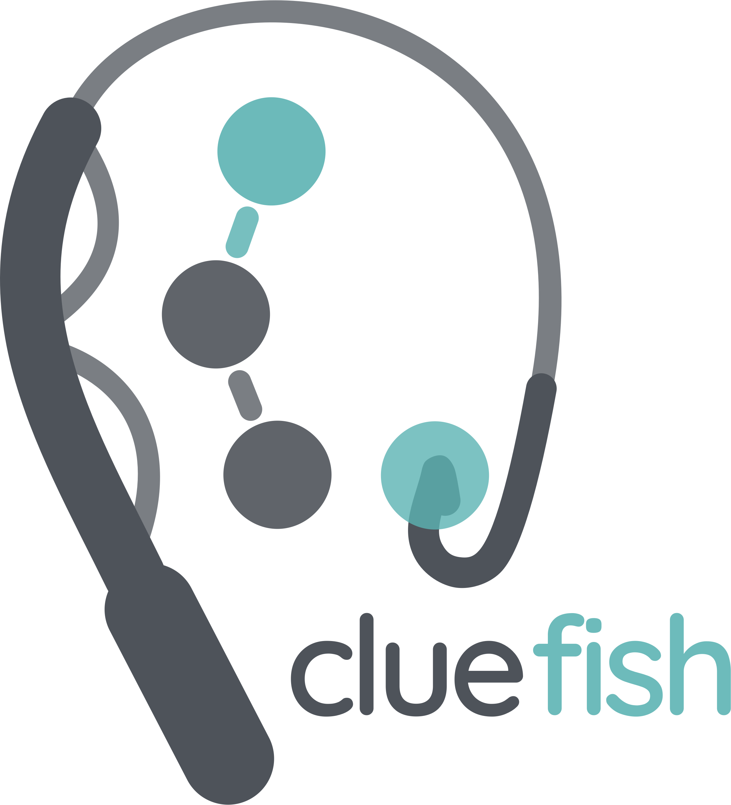

<!-- README.md is generated from README.Rmd. Please edit that file -->

<a id="readme-top"></a>

<!-- PROJECT LOGO -->

# cluefish </a>

<!-- PROJECT SHIELDS -->
<!--
*** I'm using markdown "reference style" links for readability.
*** Reference links are enclosed in brackets [ ] instead of parentheses ( ).
*** See the bottom of this document for the declaration of the reference variables
*** for contributors-url, forks-url, etc. This is an optional, concise syntax you may use.
*** https://www.markdownguide.org/basic-syntax/#reference-style-links
-->

[](https://github.com/ellfran-7/cluefish/graphs/contributors)
[](https://github.com/ellfran-7/cluefish/network/members)
[](https://github.com/ellfran-7/cluefish/stargazers)
[](https://github.com/ellfran-7/cluefish/issues)
[](https://github.com/ellfran-7/cluefish/blob/main/LICENSE)
[](https://linkedin.com/in/ellis-franklin-6188831ba)

<!-- TABLE OF CONTENTS -->
<details>
<summary>
Table of Contents
</summary>
<ol>
<li>
<a href="#overview">Overview</a>
</li>
<li>
<a href="#installation">Installation</a>
</li>
<li>
<a href="#usage">Usage</a>
</li>
<li>
<a href="#contributing">Contributing</a>
</li>
<li>
<a href="#license">License</a>
</li>
<li>
<a href="#contact">Contact</a>
</li>
<li>
<a href="#acknowledgments">Acknowledgments</a>
</li>
</ol>
</details>
<!-- ABOUT THE PROJECT -->

## Overview

Cluefish is a free and open-source, semi-automated R workflow designed
for comprehensive and untargeted exploration of transcriptomic data
series. Its name reflects the three key concepts driving the workflow:
**Clustering**, **Enrichment**, and **Fishing**—metaphorically aligned
with “*fishing for clues*”🎣 in complex biological data.

When used alongside the
[DRomics](https://lbbe-software.github.io/DRomics/) (Dose-Response for
Omics) R package, Cluefish provides a more comprehensive analysis of
dose-response transcriptomic data. In toxicology/ecotoxicology, this
will support the understanding/highlighting of contaminant’s mode of
action.

This workflow addresses the limitations of the standard
Over-Representation Analysis (ORA) by applying ORA to pre-clustered
networks. These clusters serve as anchors for ORA, enhancing enrichment
detection sensitivity and thus enabling the identification of smaller,
more specific biological processes while simultaneously forming
exploratory gene groups.

Cluefish is designed to be adaptable to a wide range of organisms, both
model and non-model, ensuring broad applicability across various
biological contexts.

------------------------------------------------------------------------

<p style="text-align: center;">
<strong>If you’re ready to dive straight into using Cluefish, check out
the
<a href="https://ellfran-7.github.io/cluefish/articles/cluefish.html">Introduction
to Cluefish vignette</a></strong>
</p>

------------------------------------------------------------------------

<p align="right">

(<a href="#readme-top">back to top</a>)

</p>
<!-- INSTALLATION -->

## Installation

The Cluefish tool is developed in **R**, so having **R** installed is a
prerequisite. You can download it
[here](https://posit.co/download/rstudio-desktop/).

For an enhanced experience, we recommend using the **RStudio**
integrated development environment (IDE), which is available for
download at the same link,
[here](https://posit.co/download/rstudio-desktop/).

You can use Cluefish locally in one of two ways:

1.  Clone the repository via a terminal:

    ``` sh
    git clone https://github.com/ellfran-7/cluefish.git
    ```

2.  Install the developmental version of Cluefish from GitHub in R
    (`remotes` needed):

    ``` r
    if (!requireNamespace("remotes", quietly = TRUE))
      install.packages("remotes")

    remotes::install_github("ellfran-7/cluefish")
    ```

<p align="right">

(<a href="#readme-top">back to top</a>)

</p>
<!-- ADDITIONAL REQUIREMENTS -->

## Additional Requirements

Cluefish relies on external open source software for an intermediate
step within its workflow. Please ensure the following tools are
installed:

1.  **Cytoscape**:

    Cluefish uses Cytoscape in order to visualize PPI networks. Install
    Cytoscape from their [download
    page](https://cytoscape.org/download.html).

2.  **Required Cytoscape Apps**:

    Within Cytoscape, install the **StringApp** and **clusterMaker2**
    apps. To do this:

    - Open Cytoscape
    - Navigate to `Apps` \> `App Store` \> `Show App Store`
    - Search for and install “StringApp” (for retrieving STRING protein
      interactions) and “clusterMaker2”” (for clustering network data).

*You can also view more about these apps on the [Cytoscape App
Store](https://apps.cytoscape.org/).*

<p align="right">

(<a href="#readme-top">back to top</a>)

</p>
<!-- USAGE EXAMPLES -->

## Usage

To run the Cluefish workflow, you can use the `make.R` script, which
serves as the ‘master’ script for the entire process. We recommend using
this script as a template to ensure smooth and sequential execution of
the workflow steps.

### Required R packages

A key feature of Cluefish is the integration of `renv` to create
reproducible environments. This allows you to install the required R
packages in two ways:

- Run `renv::install()` to install the most recent version of the
  packages listed in the `renv.lock` file.
- For full reproducibility, run `renv::restore()` to install the exact
  package versions specified in the `renv.lock` file. Note that this
  process may take longer.

### Required inputs

Cluefish requires two key inputs:

1.  **A background transcript list**: Typically, this includes the
    identifiers for all detected transcripts in the experiment.
2.  **A deregulated transcript list**: A subset of the background list,
    containing the identifiers of significantly deregulated transcripts.
    This list can be derived using any selection method.

### Recommended Selection Method

While the inputs can be derived from any selection method, Cluefish was
optimised to work seamlessly with the results from `DRomics`, a tool
tailored for dose-response modelling of omics data.

Although using `DRomics` is optional, Cluefish leverages some of its
visualization functions and modelling metrics to provide deeper insights
into the biological interpretation of the data.

*For more information on DRomics, please refer to their
[documentation](https://lbbe-software.github.io/DRomics/)*.

<p align="right">

(<a href="#readme-top">back to top</a>)

</p>
<!-- WORKFLOW -->

## Workflow

A schematic overview of the Cluefish workflow is shown below. For a
full, step-by-step guide, refer to the vignette, [Introduction to
Cluefish](https://ellfran-7.github.io/cluefish/articles/cluefish.html),
which provides instructions using the *ZebrafishDBP* example dataset.
The raw count data is publicly available on NCBI GEO and can be accessed
with **GSE283957**.

<center>


</center>
<p align="right">

(<a href="#readme-top">back to top</a>)

</p>
<!-- CITATION -->

## Citation

If you use Cluefish, please cite the associated preprint as follows:

> Franklin,E., Billoir,E., Veber,P., Ohanessian,J.,
> Delignette-Muller,M.L. and Prud’homme,S.M. (2024) Cluefish: mining the
> dark matter of transcriptional data series with over-representation
> analysis enhanced by aggregated biological prior knowledge.
> 10.1101/2024.12.18.627334.
> <https://www.biorxiv.org/content/10.1101/2024.12.18.627334v1>

A peer-reviewed publication associated with the tool will be available
soon.

<!-- CONTRIBUTING -->

## Contributing

Contributions are what make the open source community such an amazing
place to learn, inspire, and create. Any contributions you make are
**greatly appreciated**.

If you have a suggestion that would make this better, please fork the
repo and create a pull request. You can also simply open an issue with
the tag “enhancement”. Don’t forget to give the project a star! Thanks
again!

1.  Fork the Project
2.  Create your Feature Branch (`git checkout -b feature/AmazingIdea`)
3.  Commit your Changes (`git commit -m 'Add some AmazingIdea'`)
4.  Push to the Branch (`git push origin feature/AmazingIdea`)
5.  Open a Pull Request

<p align="right">

(<a href="#readme-top">back to top</a>)

</p>
<!-- LICENSE -->

## License

This project is distributed under the CeCILL Free Software License
Agreement v2.1. See `LICENSE.txt` for more information.

CECILL-2.1 is compatible with GNU GPL. See the [official CeCILL
site](http://www.cecill.eu/index.en.html) for more information.

Please note that the creative assets, such as the logos and schematics
associated with Cluefish, are distributed under the [CC-BY-SA-4.0
license](https://choosealicense.com/licenses/cc-by-sa-4.0/).

<p align="right">

(<a href="#readme-top">back to top</a>)

</p>
<!-- CONTACT -->

## Contact

If you have any need that is not yet covered, any feedback on Cluefish,
or anything other question, feel free to contact me !

Ellis Franklin - [@elffran7](https://twitter.com/elffran7) -
<ellis.franklin@univ-lorraine.fr>

Project Link: <https://github.com/ellfran-7/cluefish>

<p align="right">

(<a href="#readme-top">back to top</a>)

</p>
<!-- ACKNOWLEDGMENTS -->

## Acknowledgments

- [Othneil Drew’s README
  template](https://github.com/othneildrew/Best-README-Template)
- [Malven’s Flexbox Cheatsheet](https://flexbox.malven.co/)
- [Malven’s Grid Cheatsheet](https://grid.malven.co/)
- [Img Shields](https://shields.io/)

<p align="right">

(<a href="#readme-top">back to top</a>)

</p>
<!-- MARKDOWN LINKS & IMAGES -->
<!-- https://www.markdownguide.org/basic-syntax/#reference-style-links -->
