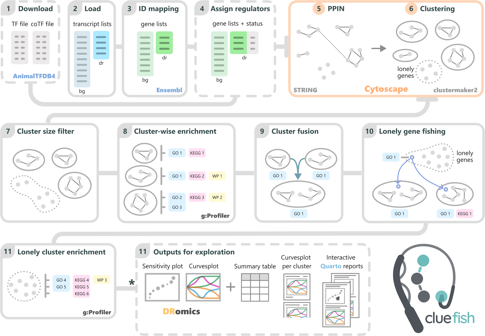

<!-- Improved compatibility of back to top link: See: https://github.com/ellfran-7/cluefish/pull/73 -->

<a id="readme-top"></a> <!--
*** Thanks for checking out the Best-README-Template. If you have a suggestion
*** that would make this better, please fork the repo and create a pull request
*** or simply open an issue with the tag "enhancement".
*** Don't forget to give the project a star!
*** Thanks again! Now go create something AMAZING! :D
-->

<!-- PROJECT LOGO -->

# cluefish </a>


<!-- PROJECT SHIELDS -->

<!--
*** I'm using markdown "reference style" links for readability.
*** Reference links are enclosed in brackets [ ] instead of parentheses ( ).
*** See the bottom of this document for the declaration of the reference variables
*** for contributors-url, forks-url, etc. This is an optional, concise syntax you may use.
*** https://www.markdownguide.org/basic-syntax/#reference-style-links
-->

[![Contributors][contributors-shield]][contributors-url]
[![Forks][forks-shield]][forks-url]
[![Stargazers][stars-shield]][stars-url]
[![Issues][issues-shield]][issues-url]
[![MIT-License][license-shield]][license-url]
[![LinkedIn][linkedin-shield]][linkedin-url]


<!-- TABLE OF CONTENTS -->

<details>

<summary>Table of Contents</summary>

<ol>

<li><a href="#overview">Overview</a></li>

<li><a href="#installation">Installation</a></li>

<li><a href="#usage">Usage</a></li>

<ul>

<li><a href="#required-inputs">Required inputs</a></li>

<li><a href="#recommended-selection-method">Recommended Selection
Method</a></li>

</ul>

<li><a href="#contributing">Contributing</a></li>

<li><a href="#license">License</a></li>

<li><a href="#contact">Contact</a></li>

<li><a href="#acknowledgments">Acknowledgments</a></li>

</ol>

</details>

<!-- ABOUT THE PROJECT -->

## Overview

<!-- [![Product Name Screen Shot][product-screenshot]](https://example.com) -->

Cluefish is a semi-automated workflow designed for the comprehensive and
untargeted exploration of dose-response transcriptomic data. Its name
reflects the three key concepts driving the workflow: **Clustering**,
**Enrichment**, and **Fishing**—metaphorically aligned with "*fishing
for clues*"🎣 in complex biological data. The workflow is particularly
useful in deciphering transcriptomic patterns in a dose-response
context.

When used in combination with
[DRomics](https://lbbe-software.github.io/DRomics/) (Dose-Response for
Omics), Cluefish provides a more comprehensive analysis of dose-response
transcriptomic data. This workflow addresses the limitations of standard
Over-Representation Analysis (ORA) by applying ORA to pre-clustered
networks. These clusters serve as anchors for ORA, enhancing enrichment
detection sensitivity and thus enabling the identification of smaller,
more specific biological processes while simultaneously forming
exploratory gene groups.

Cluefish is designed to be adaptable to a wide range of organisms, both
model and non-model, ensuring broad applicability across various
biological contexts.


<p align="right">

(<a href="#readme-top">back to top</a>)

</p>

<!-- INSTALLATION -->

## Installation

You can use Cluefish locally in one of two ways:

1.  Clone the repository via a terminal:

    ``` sh
    git clone https://github.com/ellfran-7/cluefish.git
    ```

2.  Install the developmental version of cluefish from GitHub in R
    (`remotes` needed):

    ``` r
    if (!requireNamespace("remotes", quietly = TRUE))
      install.packages("remotes")

    remotes::install_github("ellfran-7/cluefish")
    ```

<p align="right">

(<a href="#readme-top">back to top</a>)

</p>

<!-- USAGE EXAMPLES -->

## Usage

To run the Cluefish workflow, use the `make.R` script, which serves as
the 'master' script for the entire process. We recommend using this
script as a template to ensure smooth and sequential execution of the
workflow steps.

A key feature of Cluefish is the integration of `renv` to create
reproducible environments. This enables you to install the required R
packages in two ways:

-   Install the latest package versions with `renv::install()`.
-   For full reproducibility, install the exact package versions
    specified in the `renv.lock` file by running `renv::restore()`. Note
    that this process may take longer.


### Required inputs

Cluefish requires two key inputs:

1.  **Background transcript list**: Typically, this includes the
    identifiers for all detected transcripts in the experiment.
2.  **Deregulated transcript list**: A subset of the background list,
    containing the identifiers of significantly deregulated transcripts.
    This list can be derived using any selection method.

### Recommended Selection Method

While the inputs can be derived from any selection method, Cluefish was optimised to work seamlessly with the results from `DRomics`, a tool tailored for dose-response modelling of omics data.

Although using `DRomics` is optional, Cluefish leverages some of its visualization functions and modelling metrics to provide deeper insights into the biological interpretation of the data.

*For more examples, please refer to the
[Documentation](https://example.com)*

<p align="right">

(<a href="#readme-top">back to top</a>)

</p>


<!-- WORKFLOW -->

## Workflow

<p align="center">
  
</p>

*For more examples, please refer to the
[Documentation](https://example.com)*

<p align="right">

(<a href="#readme-top">back to top</a>)

</p>


<!-- CONTRIBUTING -->

## Contributing

Contributions are what make the open source community such an amazing
place to learn, inspire, and create. Any contributions you make are
**greatly appreciated**.

If you have a suggestion that would make this better, please fork the
repo and create a pull request. You can also simply open an issue with
the tag "enhancement". Don't forget to give the project a star! Thanks
again! 

1.  Fork the Project
2.  Create your Feature Branch (`git checkout -b feature/AmazingIdea`)
3.  Commit your Changes (`git commit -m 'Add some AmazingIdea'`)
4.  Push to the Branch (`git push origin feature/AmazingIdea`)
5.  Open a Pull Request

<p align="right">

(<a href="#readme-top">back to top</a>)

</p>


<!-- LICENSE -->

## License

Distributed under the CeCILL Free Software License. See `LICENSE.txt`
for more information.

<p align="right">

(<a href="#readme-top">back to top</a>)

</p>

<!-- CONTACT -->

## Contact

If you have any need that is not yet covered, any feedback on Cluefish,
or anything other question, feel free to contact me !

Ellis Franklin - [\@elffran7](https://twitter.com/elffran7) -
[ellis.franklin\@univ-lorraine.fr](mailto:ellis.franklin@univ-lorraine.fr){.email}

Project Link: <https://github.com/ellfran-7/cluefish>

<p align="right">

(<a href="#readme-top">back to top</a>)

</p>

<!-- ACKNOWLEDGMENTS -->

## Acknowledgments

-   [Othneil Drew's README template](https://github.com/ellfran-7/cluefish)
-   [Malven's Flexbox Cheatsheet](https://flexbox.malven.co/)
-   [Malven's Grid Cheatsheet](https://grid.malven.co/)
-   [Img Shields](https://shields.io/)
-   []

<p align="right">

(<a href="#readme-top">back to top</a>)

</p>


<!-- MARKDOWN LINKS & IMAGES -->
<!-- https://www.markdownguide.org/basic-syntax/#reference-style-links -->
[contributors-shield]: https://img.shields.io/github/contributors/ellfran-7/cluefish.svg?style=flat-square
[contributors-url]: https://github.com/ellfran-7/cluefish/graphs/contributors
[forks-shield]: https://img.shields.io/github/forks/ellfran-7/cluefish.svg?style=flat-square
[forks-url]: https://github.com/ellfran-7/cluefish/network/members
[stars-shield]: https://img.shields.io/github/stars/ellfran-7/cluefish.svg?style=flat-square
[stars-url]: https://github.com/ellfran-7/cluefish/stargazers
[issues-shield]: https://img.shields.io/github/issues/ellfran-7/cluefish.svg?style=flat-square
[issues-url]: https://github.com/ellfran-7/cluefish/issues
[license-shield]: https://img.shields.io/github/license/ellfran-7/cluefish.svg?style=flat-square
[license-url]: https://github.com/ellfran-7/cluefish/blob/main/LICENSE.txt
[linkedin-shield]: https://img.shields.io/badge/-LinkedIn-black.svg?style=flat-square&logo=linkedin&colorB=555
[linkedin-url]: https://linkedin.com/in/ellis-franklin-6188831ba
