```{r setup, include = FALSE}
# library(cluefish)
require(ggplot2)
set.seed(1234)
options(digits = 3)
knitr::opts_chunk$set(
  echo = TRUE,
  eval = TRUE, 
  message = FALSE, 
  warning = FALSE,
  cache= FALSE,
  collapse = TRUE,
  comment  = "#>",
  fig.width = 7, 
  fig.height = 5
)
```


<!-- Introduction  -->

<!--------------- Add Cluefish graphical abstract from paper -->

<center>


<p align="center" style="color: grey;"><em>Graphical abstract of the Cluefish workflow.</em></p>

</center>

## Preface

This vignette is intended to help users who wish to use Cluefish. The first part of this vignette is dedicated to an introduction of the context in which Cluefish was developped, followed by an overview of the workflow. The second part is dedicated to a step-by-step guide of the main Cluefish workflow using an example dose-response (DR) dataset.


## Introduction

### A bit of context

In transcriptomics, analyses yield extensive transcript lists that require impractical manual literature reviews. To address this, **functional enrichment (FE) analysis**, also known as **pathway enrichment analysis**, has become the standard approach. This method condenses large gene lists into more manageable and interpretable sets of biological functions or pathways [@das2020]. FE relies on predefined gene sets representing molecular functions, biological processes or pathways, as outlined by resources like the Gene Ontology (GO) [@ashburner2000] or pathway databases such as KEGG [@kanehisa2000] and Wikipathways [@martens2021].

FE approaches have evolved in four generations: Over-Representation Analysis (ORA), Functional Class Scoring (FCS), Pathway Topology (PT), and Network Topology (NT)-based methods[^1].

[^1]: Multiple literature reviews provide healthy descriptions and comparisons of these approaches: @khatri2012; @ihnatova2018; @ma2019; @garcía-campos2015; @bayerlová2015; @huang2009;.

Each generation introduced improvements by accounting for gene co-expression, pathway topology, and network crosstalk. However, PT and NT-based approaches face limitations due to incomplete pathway and network information for lesser studied organisms, making ORA and FCS the most widely used methods [@liu2017].

While these earlier methods are commonly applied to transcriptomic data with two or three conditions, dealing with data involving many ordered conditions—referred to as “data series”—poses substantial complexity.

In dose-response (DR) studies, which explore the relationship between exposure and biological effect, DR omics analyses play a critical role [@lovell2016]. Unlike standard differential expression analyses, DR methods, such as the [`DRomics`](https://lbbe-software.github.io/DRomics/) (Dose-Response for Omics) R package [@larras2018], model the full DR relationship of each transcript rather than just fold-change between conditions. From these models, a benchmark dose (BMD) is calculated for each transcript : a dose that represents a specific change in response, indicating a gene’s sensitivity to a stressor [@committee2017].

While differential gene expression analysis provides fold-change values and their associated p-values, modelling approaches, such as `DRomics`, characterise the entire DR relationship. PT-based enrichment and FCS, which rely on fold-change values, are therefore not adapted for functional enrichment in a DR context [@khatri2012]. ORA is currently the only suitable method available to complement DR modelling, as it exclusively uses deregulated gene lists. However, ORA comes with several other limitations. The enrichment results, often based on Fisher’s Exact Tests, can be biased towards broad biological functions, since using all deregulated genes makes it harder to reach statistical significance for smaller or specialised functions. This tendency is intrinsically tied to the granularity of gene sets in certain databases (e.g., GO). Gene sets associated to a biological process/pathway may be overly specific, while others are too general, potentially compromising the relevance of the analysis [@karp2021; @mubeen2022]. Additionally, gene sets may vary in specificity, and results often reflect only part of the deregulated gene list. Therefore, ORA alone (hereafter referred to as the "**standard approach**") is insufficient for interpreting complex DR data, and combining additional methods is essential to capture a fuller and more precise view of the biological context.


### Overview of Cluefish

To address these limitations, we developed [Cluefish](https://github.com/ellfran-7/cluefish) [Franklin *et al.* (submitted)](https://www.biorxiv.org/content/10.1101/2024.12.18.627334v1), a free and open-source, semi-automated workflow designed for comprehensive and untargeted exploration of transcriptomic data series. Its name reflects the three key concepts driving the workflow: **Clustering**, **Enrichment**, and **Fishing**—metaphorically aligned with "*fishing for clues*"🎣 in complex biological data.

Cluefish is composed of 10 main steps:

1.  Download transcription factor (TF) and co-factor (CoTF) gene annotations (*optional*) ([Step 1](#step1)).
2.  Load background and deregulated transcript lists ([Step 2](#step2)).
3.  Retrieve gene identifiers ([Step 3](#step3)).
4.  Assign regulatory status ([Step 4](#step4)) (*only possible if Step 1 is performed*).
5.  Construct, cluster the PPI network of the deregulated gene list and then retrieve the results ([Step 5](#step5)).
6.  Filter gene clusters based on gene set size ([Step 6](#step6)).
7.  Perform cluster-wise functional enrichment ([Step 7](#step7)).
8.  Merge clusters sharing enriched biological functions ([Step 8](#step8)).
9.  Fish *lonely genes* into existing clusters based on shared functional annotations ([Step 9](#step9)).
10. Perform simple functional enrichment on the remaining lonely genes, forming the  *lonely cluster* ([Step 10](#step10)).

<center>

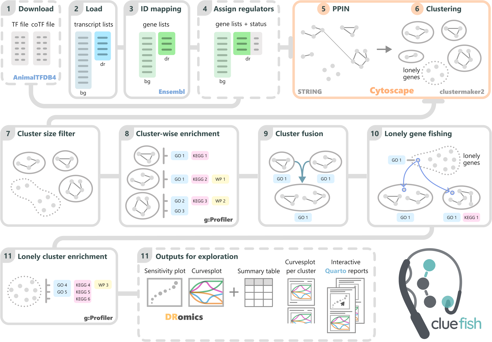
<p align="center" style="color: grey;"><em>Schematic of the Cluefish workflow.</em></p>

</center>

Cluefish integrates valuable information from various biological functional/pathway databases (e.g., GO, KEGG, WP), the AnimalTFDB4 database of transcription factors and co-factors for \>180 animal genomes, and the STRING database of known an predicted PPIs for \>12,000. Despite drawing from multiple complementary resources, these databases collectively provide a broad coverage of organisms, ensuring that Cluefish is applicable to a wide range of both model and non-model species.

<br>

<!-- Installation -->

## Installation

You can use Cluefish locally in one of two ways:

1.  Clone the repository via a terminal:

    ``` sh
    git clone https://github.com/ellfran-7/cluefish.git
    ```

2.  Install the developmental version of Cluefish from GitHub in R (`remotes` needed):

    ```{r, eval = FALSE}
    if (!requireNamespace("remotes", quietly = TRUE))
      install.packages("remotes")

    remotes::install_github("ellfran-7/cluefish")
    ```

<br>

<!-- Additional Requirements -->

## Additional Requirements

The Cluefish workflow is developed in **R**, so having R installed is a prerequisite. You can download it [here](https://posit.co/download/rstudio-desktop/). 

For an enhanced experience, we recommend using the **RStudio** integrated development environment (IDE), which is available for download at the same link, [here](https://posit.co/download/rstudio-desktop/).

Additionally, Cluefish relies on external open source software for an intermediate step within its workflow. Please ensure the following tools are installed:

1.  **Cytoscape**:
    
    Cluefish uses Cytoscape in order to visualise PPI networks. Install Cytoscape from their [download page](https://cytoscape.org/download.html).

2.  **Required Cytoscape Apps**:
    
    Within Cytoscape, install the **StringApp** and **clusterMaker2** apps. To do this:
    -  Open Cytoscape
    -  Navigate to `Apps` > `App Store` > `Show App Store`
    -  Search for and install "StringApp" (for retrieving STRING protein interactions) and "clusterMaker2" (for clustering network data).

**You can also view more about these apps on the [Cytoscape App Store](https://apps.cytoscape.org/).**

<br>

<!-- Naming Convention -->

## Naming Convention

To enhance consistency and readability, we have incorporated a standardised naming convention for data files, inputs, intermediate objects, and outputs:
  
1.  **Data type**:
    -   `dr`: deregulated data (only deregulated items)
    -   `bg`: background data (all experimental items)


2.  **Data format**:
    -   `t`: transcript-per-row data, where each row corresponds to a single transcript
    -   `g`: gene-per-row data, where each row corresponds to a single gene


3.  **Annotation**:
    For each of the aforementioned patterns, an optional biological annotation '`a`' is appended. This annotation facilitates a specific delineation, providing one row per annotation. For example, '`t_a`' signifies that the data is formatted with one row corresponding to a single transcript alongside one of its corresponding annotations.
 
<u>Examples</u>:

-   `bg_t_data`: background data with each row corresponding to a single transcript
-   `dr_g_a_data`: deregulated data with each row corresponding to a specific combination of gene and annotation

<br> 

<!-- Getting started -->

## Usage

To run the Cluefish workflow, you can use the `make.R` script, which serves as the 'master' script for the entire process. We recommend using this script as a template to ensure smooth and sequential execution of the workflow steps. 

Here we will go through the main steps one by one !

### The case study

In order to showcase Cluefish, we will use an example dataset. This is a dose-response transcriptomic dataset, where zebrafish embryos were exposed to a five dose-gradient of dibutyl phthalate. The experiment and resulting dataset is further described in the associated paper [Franklin *et al.* (submitted)](https://www.biorxiv.org/content/10.1101/2024.12.18.627334v1) and you may access the count data at GEO, under the accession number [GSE283957](https://www.ncbi.nlm.nih.gov/geo/query/acc.cgi?acc=GSE283957).

::: note
In addition to the zebrafish dataset used in this vignette, two external transcriptomic datasets were analysed in the associated study: the rat liver dataset from Gwinn *et al.* ([GSE147072](https://www.ncbi.nlm.nih.gov/geo/query/acc.cgi?acc=GSE147072)) and the poplar root dataset from Gréau *et al.* ([GSE263776](https://www.ncbi.nlm.nih.gov/geo/query/acc.cgi?acc=GSE263776)). Both datasets are publicly available through the GEO database.You may find their analysis files in the repository itself.
:::

### Before walking

A key feature of Cluefish is the integration of `renv` [@ushey2024] to create reproducible environments. This enables you to install the required R packages in two ways:

1.  Install the latest package versions with `renv::install()`.

```{r, eval = FALSE}
renv::install()
```

2.  For full reproducibility, install the exact package versions specified in the `renv.lock` file by running `renv::restore()`. Note that this process may take longer.

```{r, eval = FALSE}
renv::restore()
```

Once the packages installed or restored, you can then load the project R functions with:

```{r}
devtools::load_all(here::here())
```


If no errors have appeared, you are all set to go !

<br> 

### Step 1: Download transcription (co-)factor annotations {#step1}

Before proceeding, check if your organism of interest is available in the AnimalTFDB database. A list of supported species can be found on their website: [Go to AnimalTFDB](https://guolab.wchscu.cn/AnimalTFDB4/#/Species).

1.  If you organism is not listed in the database, you may skip this step.

2.  If your organism is listed, retrieve the URLs for both the transcription (TF) and co-transcription factors (CoTF). For example, the URLs for zebrafish (*Danio rerio*) are:
    -  TF: "<https://guolab.wchscu.cn/AnimalTFDB4_static/download/TF_list_final/Danio_rerio_TF>"
    -  CoTF: "<https://guolab.wchscu.cn/AnimalTFDB4_static/download/Cof_list_final/Danio_rerio_Cof>"


To download data for a different species, replace "`Danio_rerio`" in the URL with the Latin name of your organism.

Use the <span class="homemade-function">`dl_regulation_data()`</span> function downloads the TF and CoTF data files to a specified directory. Customise the file paths and names by setting the function arguments as shown below:

```{r, eval = FALSE}
dl_regulation_data(
  url_tf = "https://guolab.wchscu.cn/AnimalTFDB4_static/download/TF_list_final/Danio_rerio_TF",
  url_cof = "https://guolab.wchscu.cn/AnimalTFDB4_static/download/Cof_list_final/Danio_rerio_Cof",
  path = "your/chosen/path", # the path where you want to save the files
  filename_tf = "TF_filename.txt", # the chosen TF filename 
  filename_cof = "CoTF_filename.txt"), # the chosen CoTF filename
  overwrite = TRUE
)
```

***

<span class="italic-grey"> The `overwrite` argument controls whether existing files with the same name in the target directory are replaced. Setting `overwrite = TRUE` allows the function to overwrite files, while `overwrite = FALSE` preserves existing files to prevent accidental loss of data.</span>

***

For more info on each argument of the function, run `?cluefish::dl_regulation_data()`.

For simplicity in this vignette, we will use two pre-saved example files: `example_TF_file.txt` and `example_CoTF_file.txt`.

The transcription (co)factor data will be used in [Step 3](#step3) to determine the regulatory status of the deregulated genes.

<br>

### Step 2: Load background and deregulated transcripts lists {#step2}

For this step, load the **background** and **deregulated transcript lists**. These must be acquired beforehand.

The **background transcript list** corresponds to a character vector of all transcript IDs detected in the experiment, whereas the **deregulated transcript list** contains only the IDs of significantly deregulated transcripts.

Multiple identifiers are available for transcripts and genes.

Pay special attention to the type of transcript identifier used, as this will be crucial for the next step. For instance, "**ENSDART00000080481.6**" is the *Ensembl transcript stable ID* for the *rxraa-201*.

***
<span class="italic-grey">While the inputs can be derived from any selection method, Cluefish was optimised to work seamlessly with the results from `DRomics`. In addition, Cluefish leverages some of `DRomics` visualisation functions and modelling metrics to provide deeper insights into the biological interpretation of the data.</span>

***

With the `DRomics` analysis performed beforehand in our case, we can retrieve the outputs of: 

-  the `drcfit()` function: holding the background transcript list 
-  the `bmdboot()` function: holding the deregulated transcript list

```{r}
# Load the DRomics "drcfit" object
f <- readRDS(file = "data/example_fitres.rds")
# Load the DRomics "bmdboot" object results ($res)
b <- readRDS(file = "data/example_bootres.rds")

# Extract the background transcript identifiers as a character vector
bg_transcript_list <- f$omicdata$item
# Extract the deregulated transcript identifiers as a character vector
dr_transcript_list <- b$id
```

We can get a look of the transcript identifiers and the count for each list with either `str()`:

```{r}
str(bg_transcript_list)
```

```{r}
str(dr_transcript_list)
```

Or if the `dplyr` package is installed: 

```{r}
dplyr::glimpse(bg_transcript_list)
```

```{r}
dplyr::glimpse(dr_transcript_list)
```

<br>

### Step 3: Retrieve gene identifiers {#step3}

Next, retrieve specific gene identifiers. Before proceeding, we recommend gathering some essential elements from Ensembl BioMart:

-  The Ensembl BioMart service where your organism’s dataset is located
-  The specific dataset name for your species within the BioMart service.
-  The identifiers you want to retrieve (e.g, gene)

It's important to gather this information in advance, as each element has unique naming conventions specific to Ensembl BioMart.
To do so :

1.  Identify the Ensembl BioMart services currently available. To list all active services, use the `listEnsembl()` function (or `listMarts()`):
    ```{r, eval = FALSE}
    biomaRt::listMarts()
    biomaRt::listEnsembl()
    ```
The main Ensembl BioMart service provides annotations for vertebrate genomes. For annotations of Protists, Metazoa, and Fungi, specialised BioMart interfaces are also available. We can use the `listEnsemblGenomes()`function to list these options:
    ```{r, eval = FALSE}
    biomaRt::listEnsemblGenomes()
    ```

2.  Once the appropriate Ensembl BioMart service is identified, connect to it using `useMart()`, `useEnsembl(`), or `useEnsemblGenomes()`. Specify the `biomart` argument with a name from the previous step’s output:
    ```{r, eval = FALSE}
    ensembl <- biomaRt::useMart(biomart = "ENSEMBL_MART_ENSEMBL")
    ```

3.  Within the selected BioMart service, each species has its own dataset. List the available datasets using the `listDatasets()` function:
    ```{r, eval = FALSE}
    biomaRt::listDatasets(mart = ensembl)
    ```

4. BioMart allows you to retrieve various types of information (e.g., gene or transcript IDs). Use either `listAttributes()` or `listFilters()` to view available identifiers and filters:
    ```{r, eval = FALSE}
    biomaRt::listAttributes(mart = ensembl)
    #OR 
    biomaRt::listFilters(mart = ensembl)
    ```

With the required elements gathered, employ the <span class="homemade-function">`getids()`</span> function to retrieve gene (`gene_id`) and gene name (`gene_name`) identifiers corresponding to the transcript identifiers (`transcript_id`) associated to the background transcript list (`bg_transcripts_list`).

<span class="italic-red"><u>Important</u>: To ensure compatibility with the databases and tools used later in Cluefish—specifically the **STRING** database and **g:Profiler**—it is important that the output dataframe from the `getids()` function includes *at least one identifier* supported by both platforms. However, if no single identifier meets this requirement, *two separate identifiers* may be used, ensuring that one is valid for STRING and the other for g:Profiler. 

For example, in the case of *Danio rerio* (Zebrafish), the **Ensembl gene ID** is supported by both platforms, eliminating the need for additional identifier conversion. However, in the case of *Daphnia magna* (Water flea), the **Ensembl gene ID** is supported by g:Profiler but not by the STRING database. In this case, the **UniProt Protein identifier** is supported by STRING, so both identifiers should be retrieved to ensure compatibility. </span>

```{r, eval = FALSE}
bg_t_ids <- getids(
  id_query = bg_transcripts_list, 
  biomart_db = "ENSEMBL_MART_ENSEMBL",
  species_dataset = "drerio_gene_ensembl",
  transcript_id = "ensembl_transcript_id_version",
  gene_id = "ensembl_gene_id",
  gene_name = "external_gene_name",
  other_id = NULL
)
```

For more information on each argument of the function, run `?cluefish::getids()`.


<br>

<details>
  <summary>Understand `gene_id`, `gene_name` and `other_id` usage</summary>
  
  -   **`gene_id`**: This identifier is essential for downstream steps, such as querying the protein-protein interaction (PPI) network ([Step 5]{#step5}) and performing functional enrichment using g:profiler ([Step 7]{#step7}). For instance, with *Danio rerio* as our organism, the `ensembl_gene_id` is supported by both the STRING and g:profiler database, minimising the need for additional ID conversions and ensuring compatibility across resources.
  -   **`gene_name`**:  This identifier enhances biological interpretability by providing descriptive labels, such as the `external_gene_name` or `description`. These labels offer intuitive gene names that clarify gene functions or roles in biological processes, aiding in result interpretation and annotation.
  -   **`other_id`**: Additional identifiers can be rerquested if there are other annotation needs, such as protein IDs or alternative identifiers related to specific transcripts or gene annotations. 

</details>

<br>


<details>
  <summary>Effort to remove redundancy between `transcript_id`, `gene_id` and `gene_name`</summary>
  
In many cases, a single gene can have multiple transcripts, and the same gene symbol (like `external_gene_name`) may correspond to different Ensembl gene IDs, creating redundancy in the data. The <span class="homemade-function">`getids()`</span> function handles this redundancy by:

1.  Checking if the query includes the "`external_gene_name`" attribute in the `gene_name` argument.
2.  Identifying any duplicate `transcript_id` and/or `gene_id` entries across rows.

When duplicates are found, the function assigns unique names to `gene_name` using a **`_g#t#`** format:

*  **`g#`** represents the gene index
*  **`t#`** represents the transcript index

<u>For example</u>:

*  If a single `gene_id` has multiple transcripts with the same `gene_name` (like "`agrn`"), the function labels them as "**`agrn_g1t1`**", "**`agrn_g1t2`**", and so on. This indicates different transcripts for the same gene.
*  If another `gene_id` with the same `gene_name` appears, it gets a new gene index, resulting in labels like "**`agrn_g2t1`**, indicating it belongs to a second gene.

If no `gene_name` is found for certain transcripts, the function assigns "`Unknown`" and applies the same **`_g#t#`** numbering (e.g., **`Unknown_g1t1`**, **`Unknown_g1t2`**).

This systematic labeling helps make each transcript-gene relationship unique, aiding in clear interpretation and visualisation of results.

</details>

<br>


```{r, echo = FALSE}
bg_t_ids <- read.table("data/example_bg_t_ids.txt")
```

We can get a look at the structure of the output:

```{r}
dplyr::glimpse(bg_t_ids)
```

As the result consists of the background list identifiers, you need to subset the deregulated data. This can be done as shown below:

```{r}
dr_t_ids <- bg_t_ids[bg_t_ids$transcript_id %in% dr_transcript_list,]
```

<br>

### Step 4: Determine deregulated gene regulatory status {#step4}

This step involves determining the regulatory status of deregulated genes, using the TF and CoTF files downloaded in [Step 1](#step1). if your organism was not supported in AnimalTFDB, you can skip this step! 

If the TF and CoTF files are available, use the <span class="homemade-function">`getregs()`</span> function to add a regulatory status column (`TF`). This column will contain a logical value (`TRUE/FALSE`), indicating whether each gene is a TF or CoTF.

The function requires the output of the previous `getids()` function and the file paths for both the TF and CoTF files.

```{r}
dr_t_regs <- getregs(
  getids_data = dr_t_ids,
  regulator_file = "data/example_TF_file.txt",
  coregulator_file = "data/example_CoTF_file.txt"
)
```

For more information on each argument of the function, run `?cluefish::getregs()`.

We can look at the structure of the output:

```{r}
dplyr::glimpse(dr_t_regs)
```

<br>

### Step 5: Construct and retrieve the clustered protein-protein interaction (PPI) network {.tabset #step5}

This step involves creating a clustered protein-protein interaction (PPI) network using Cytoscape, an external visualisation tool. Start by saving the R output to a file:

```{r, eval = FALSE}
write.table(dr_t_regs, file = "your/chosen/path/filename.txt", row.names = FALSE, sep = "\t")
```

Once the file is saved, open Cytoscape and follow the steps below to import, create, and cluster the PPI network, then return to the R environment to continue the analysis.

#### Start {-}

<center>

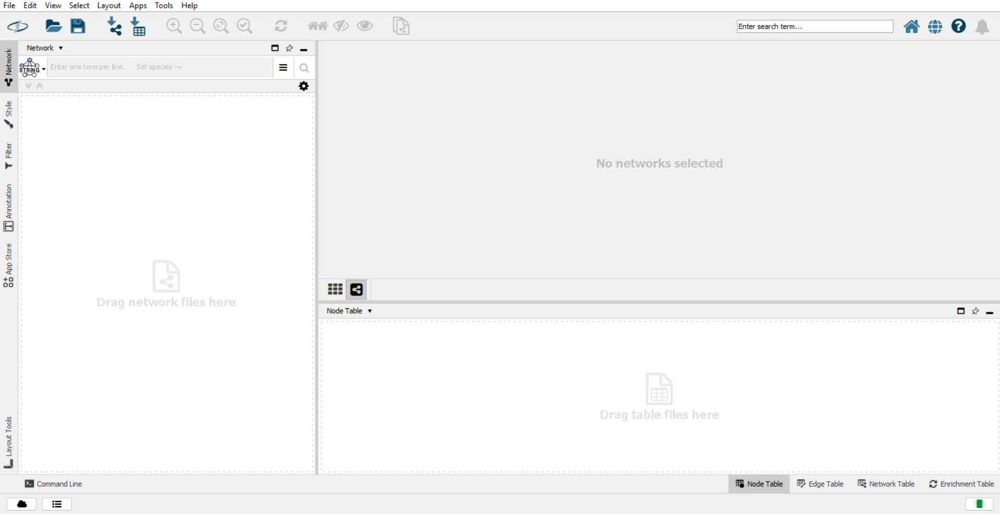{width=75%}

</center>

<br>

#### 1 {-}

In Cytoscape, go to `File` > `Import` > `Table from File`

<center>

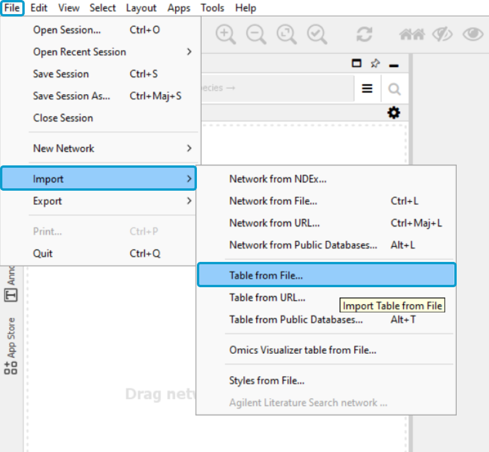{width=50%}
</center>

<br>

#### 2 {-}

Select the saved text file, click `Open`, name the table and select `OK`

<center>

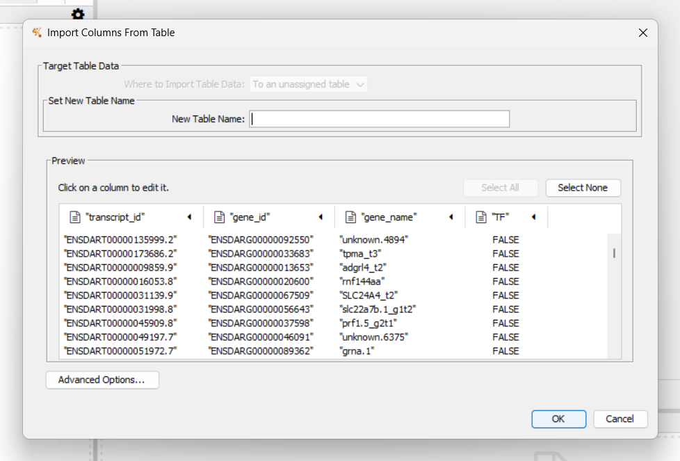{width=65%}
</center>

<br>

#### 3 {-}

Right-click the column with ids for querying proteins (e.g., `gene_id`) (1), then select `Copy Column Values` (2)

<center>

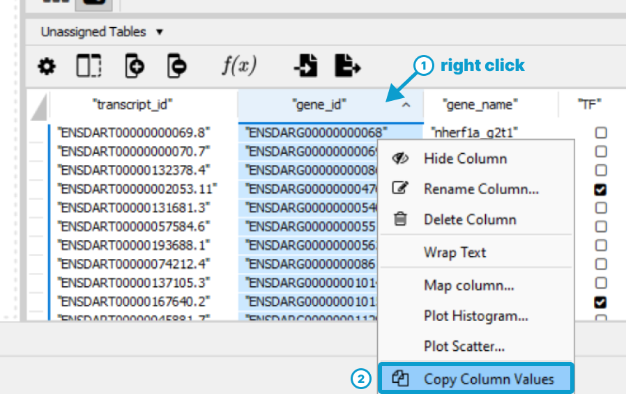{width=65%}

</center>

<br>


#### 4 {-}

Ensure you are using the *Protein Query* feature with StringApp.

<center>

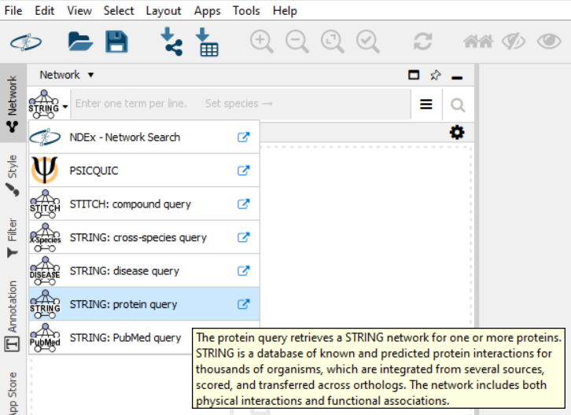{width=65%}

</center>

<br>

#### 5 {-}

In the StringApp query section, paste (`Ctrl`+`V`) the copied values

<center>

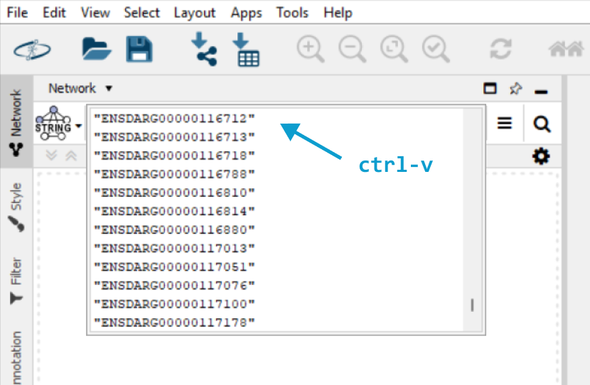{width=65%}
</center>

<br>

#### 6 {-}

Adjust the query settings:

  1.  Click on the "**More options...**" icon
  2.  Select the species (e.g., *Danio rerio*)
  3.  Select the network type[^2]
  4.  Select a confidence score cutoff[^3]
  5.  Make sure that maximum additional interactors is at "0"![^4]

[^2]: The choice is either "**full STRING network**", meaning both direct (physical) and indirect (functional) interactions or "**physical network**" for just direct interactions [@szklarczyk2019].
[^3]: All scores rank from 0 to 1, with 1 being the highest possible confidence. A score of 0.5 would indicate that roughly every second interaction might be erroneous (i.e., a false positive) ([See STRING info](https://string-db.org/cgi/info)).
[^4]: Adding interactors meaning adding supplementary information than what we give STRING. This does not make sense for our analysis as we are focusing solely on the deregulated items.


<center>

Visit the [STRING documentation](https://string-db.org/) to getting a fuller understand of these concepts.

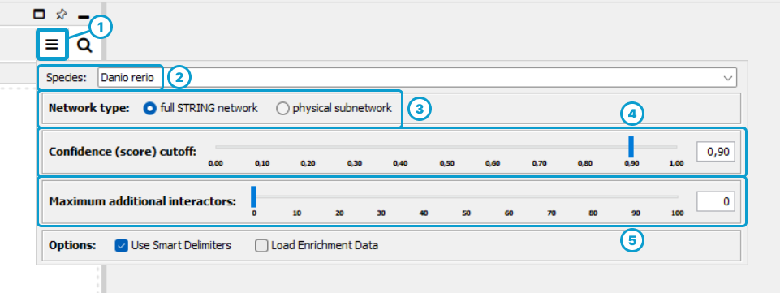{width=70%}
</center>

<br>

#### 7 {-}

Run the query (1), view the PPI network, then click on "**Clustering**" (2)

<center>

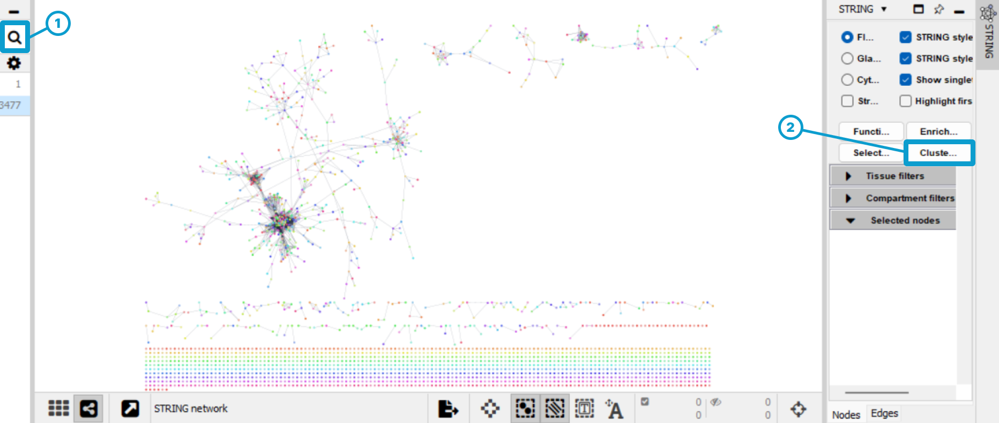{width=80%}
</center>

<br>

#### 8 {-}

Choose a granularity (inflation) value to adjust cluster sizes[^5], then click "**OK**"

[^5]: Inflation affects the granularity or resolution of the clustering outcome, with low values (1.3, 1.4) leading to fewer and larger clusters and high values (5, 6) leading to more and smaller clusters; the default value of 2 is a good starting point [@vandongen2008]. To get a better understanding of MCL clustering, visit http://micans.org/mcl/.

<center>

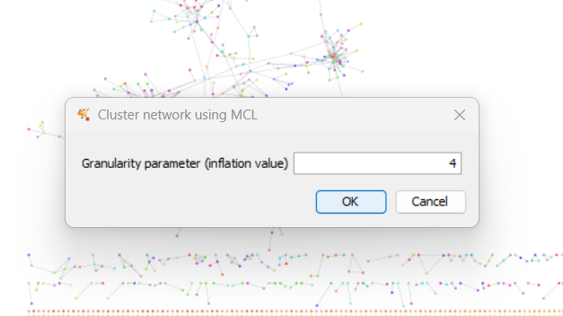{width=65%}
</center>

<br>
 
#### 9 {-}

Open the **`Node Table`** (1) and click on the `Export Tables to File...` icon (2). Finally, save the table in .csv format within your working directory.

<center>

With the node table saved, we can now return to the R environment and import the table.

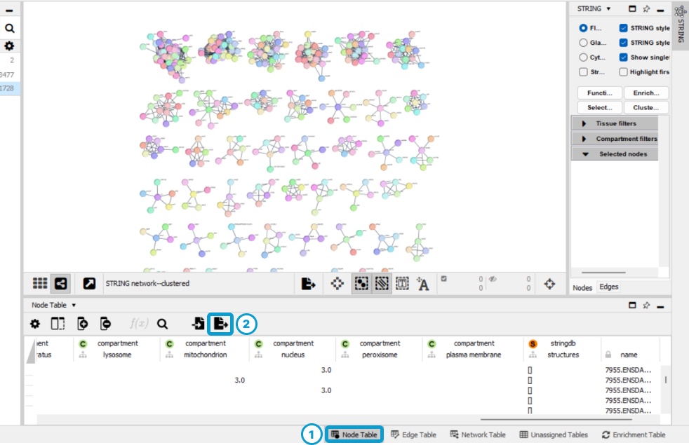{width=75%}
</center>


### {-}


Using the <span class="homemade-function">`getclustrs()`</span> function, retrieve and merge the node table with the output of the <span class="homemade-function">`getregs()`</span> function. Therefor it requires the output from the function used in [Step 3](#step3), the column name to use for merging and the nodetable path and filename, as shown below :

```{r, eval = FALSE}
dr_t_clustrs <- getclustrs(
  gene_data = dr_t_regs,
  colname_for_merge = "gene_id",
  path = "your/chosen/path",
  nodetable_filename = "filename.csv"
)
```

For more information on each argument of the function, run `?cluefish::getclustrs()`.

```{r, echo = FALSE}
dr_t_clustrs <- getclustrs(
  gene_data = dr_t_regs,
  colname_for_merge = "gene_id",
  path = "data",
  nodetable_filename = "example_nodetable_cytoscape.csv"
)
```


We can look at the structure of this output:
```{r}
dplyr::glimpse(dr_t_clustrs)
```


We can also get an idea of the size of the clusters:
```{r}
table(dr_t_clustrs$clustr)
```

<br>

### Step 6: Filter clusters {#step6}

In this step, we filter clusters based on their gene set sizes using the **lower cluster size filter**. This filter retains only clusters meeting or exceeding a specified minimum size, helping to focus on clusters that are likely biologically relevant.

The function <span class="homemade-function">`clustrfiltr()`</span> applies this filter, requiring two main arguments: 

*  `getclustrs_data`: the output from the <span class="homemade-function">`getclustrs()`</span> function
*  the desired **lower cluster size filter** value.

<details>
  <summary>Choosing an appropriate lower cluster size limit</summary>
  
The choice of size limit depends on factors such as the type of study, the organism, and prior steps in the PPI network creation and clustering. Setting a higher size limit will retain fewer, larger clusters, while a lower limit will include both large and small clusters. Note that:

*  **Large** clusters may lack specific biological context due to their broad inclusivity.
*  **Small** clusters may suffer from limited statistical support and might not represent distinct biological complexes. Instead, they could reflect case-specific or transient interactions.

Consider these factors when deciding on an appropriate size limit.

</details>

```{r, message = FALSE, }
dr_t_clustrs_filtr <- clustrfiltr(
  getclustrs_data = dr_t_clustrs,
  size_filtr = 4 # default value
)
```

For more information on each argument of the function, run `?cluefish::clustrfiltr()`.

The function outputs a named list with three components:

*  **`kept`**: A dataframe of type **t** holding clusters retained after filtering
*  **`removed`**: A dataframe of type **t** holding clusters filtered out
*  **`params`**: A list of the main parameters used; in this case the choice for `size_filtr` 

We can take a look at the output's structure:
```{r}
dplyr::glimpse(dr_t_clustrs_filtr)
```

We can also see which clusters were retained:
```{r}
table(dr_t_clustrs_filtr$kept$clustr)
```

***

<span class="italic-grey">Genes that are not retained in this step have now become *lonely genes*.

***

<br> 

### Step 7: Perform cluster-wise functional enrichment {#step7}

This step applies Over-Representation Analysis (ORA) to characterise each cluster using the `gprofiler2` R package [@kolberg2020], which interfaces with g:Profiler's [@kolberg2023] ressources and functions. The g:GOst function performs ORA across multiple gene lists, analysing against sources such as GO, KEGG, and WP. For more information on g:Profiler and g:GOst, visit the web interface [here](https://biit.cs.ut.ee/gprofiler/gost). 

The <span class="homemade-function">`clustrenrich()`</span> function, built on g:GOst, performs cluster-wise ORA. 

The function applies g:GOst's highlighting GO driver terms by considering the underlying topology of annotations, as described in Kolberg et al. 2023. 

Consider the following g:GOst key options: 

*  `sources`: Functional data sources to analyse against (e.g. "GO", "KEGG") 
*  `domain_scope`: Background choice (e.g. "annotated", "known", "custom")
*  `correction_method`: Multiple testing correction method, e.g., FDR
*  `user_threshold`: P-value threshold for significance, e.g. 0.05

These are a few key options, but many others are available. Some require careful thought to select the best value, method, or scope. For more details, check the documentation on their [site](https://biit.cs.ut.ee/gprofiler/gost) or reading the help of the function by running `?gprofiler2::gost()` in R.

Additionally, two new filters have been integrated with the construction of the <span class="homemade-function">`clustrenrich()`</span> function:

*  **Biological function size filter** (`min_term_size` and `max_term_size`): Filter based on upper and lower gene set size limits to control for biological function specificity
   
   ***
   
   <span class="italic-grey">Very large gene sets, which are dependent on the organism, are often associated with broad biological processes. These can introduce noise and obscure more specific functions. Conversely, very small gene sets can be overly specific and may not capture the full biological context of a pathway. </span>
    
   ***

*  **Enrichment gene count filter** (`ngenes_enrich_filtr`): Filters based on the number of genes contributing to enrichment of a cluster. 
   
   ***
   
   <span class="italic-grey">Small clusters can lead to a higher rate of false positives, and enrichments based on very few genes may not provide substantial biological insight into the cluster itself. </span>
   
   ***

The function data inputs include:

*  **`clustrfiltr_data`**: The named list output from the <span class="homemade-function">`clustrfiltr()`</span> function
*  **`dr_genes`**: The character vector of deregulated genes that can correspond to the **`gene_id`** column in the output of the <span class="homemade-function">`getids()`</span> or  <span class="homemade-function">`getregs()`</span> function.
*  **`bg_genes`**: The character vector of background genes (preferably from the experiment) that typically corresponds to the ‘gene_id’ column in the output of the <span class="homemade-function">`getids()`</span> function.

```{r, eval = FALSE}
clustr_enrichres <- clustrenrich(
  clustrfiltr_data = dr_t_clustrs_filtr,
  dr_genes = dr_t_regs$gene_id,
  bg_genes = bg_t_ids$gene_id,
  bg_type = "custom_annotated",
  sources = c("GO:BP", "KEGG", "WP"), 
  organism = "drerio",
  user_threshold = 0.05,
  correction_method = "fdr",
  exclude_iea = FALSE, 
  min_term_size = 5,
  max_term_size = 500,
  only_highlighted_GO = TRUE,
  ngenes_enrich_filtr = 3,
  path = "your/chosen/path",
  output_filename = "filename.rds",
  overwrite = FALSE
)
```

For more information on each argument of the function, run `?cluefish::clustrenrich()`.

The output is a named list with four components:

*  **`dr_g_a_enrich`**: A dataframe of type **g_a** holding the cluster-wise enrichment results
*  **`gostres`**: A named list corresponding to the original result output of g:GOst
*  **`dr_g_a_whole`**: A dataframe of type **g_a** holding all the biological function annotations found in the g:profiler database for all the deregulated genes.
*  **`c_simplify_log`**: A dataframe of tracing the number of biological functions enriched per cluster before and after each filtering step for each source.
*  **`params`**: A list of the main parameters used; in this case the choice for `monoterm_fusion` 


```{r, echo = FALSE}
clustr_enrichres <- readRDS("data/example_clustr_enrichres.rds")
```

We can take a look at the structure of the **`dr_g_a_enrich`** dataframe:

```{r, echo = FALSE}
dplyr::glimpse(clustr_enrichres$dr_g_a_enrich)
```

After running the function, we recommend checking if the filters need adjustment, as finding the right lower and upper limits for gene set sizes can be quite a challenge. These limits depend on the organism, the type of transcriptomic data, and what constitutes 'general' terms for this study.

To help determine if the size limits are suitable, the following code lists all terms associated with deregulated genes in descending order by size, giving insight into the generality of terms and guiding any needed adjustments:

```{r}
clustr_enrichres$dr_g_a_whole |> 
  dplyr::group_by(term_name) |> 
  dplyr::summarise(count = dplyr::n()) |> 
  dplyr::arrange(desc(count)) |> 
  print(n = 10) # Number of rows to print, adjustable based on the study
```

If you have the `DT` package installed, you can view this data interactively in the viewer pane:

```{r}
clustr_enrichres$dr_g_a_whole |> 
  dplyr::group_by(term_name) |> 
  dplyr::summarise(count = dplyr::n()) |>
  DT::datatable(
    options = list(pageLength = 10
    ),
    filter = 'top',
    class = c("compact")
  )
```

<br>


### Step 8: Merge clusters {#step8}

Following cluster characterisation, this step consists in identifying and merging clusters that share the same enriched biological functions from at least one specified data source (e.g. GO, KEGG etc.) in the ORA. This step allows us to merge multiple clusters where the gene proteins were not found to be sufficiently interactive in STRING to be considered a single cluster. However, functional enrichment revealed that they participate in the same biological processes. Therefore, clusters that do merge form a larger and more comprehensive cluster, holding a unique biological context. 

To do so, the step uses the <span class="homemade-function">`clustrfusion()`</span> function, which requires the output of the <span class="homemade-function">`clustrenrich()`</span> function as its input data.

***
<span class="italic-grey">The merging process is conducted separately for each data source, in descending order of the total number of unique genes present in both the data source and the background list. An optional parameter, `monoterm_fusion`, can be set to `TRUE` to restrict merging to clusters that share a single, identical enrichment term in at least one source. This ensures that merged clusters are consistently linked to a specific biological function, maintaining a coherent biological context. By default this is set to `FALSE` as the merging process becomes highly stringent, as it requires clusters to be associated with the same unique biological function. This can significantly limit the likelihood of merging. </span>

***

```{r, message = FALSE}
clustr_fusionres <- clustrfusion(
  clustrenrich_data = clustr_enrichres,
  monoterm_fusion = FALSE
)
```

The output is a named list with four components:

*  **`dr_g_a_fusion`**: A dataframe of type **g_a** holding the cluster fusion results
*  **`dr_g_a_fusion`**: A dataframe of type **c_a**  holding the cluster fusion results
*  **`c_fusionlog`**: A dataframe tracing cluster fusion events, indicating the sources from which they originated (e.g. GO, KEGG or WP)
*  **`params`**: A list of the main parameters used; in this case the choice for `monoterm_fusion` 

We can take a look at the structure of the output:
```{r}
dplyr::glimpse(clustr_fusionres)
```


<br>

### Step 9: Fish lonely genes {#step9}

Genes not assigned to any cluster are referred to as *lonely genes*. These genes are not typically explored because they do not contribute to functional enrichment, and thus, they do not help in characterising the data. This step involves "fishing" these *lonely genes* into existing clusters.

***
<span class="italic-grey">Genes become lonely in one of two cases :</span> 

*  <span class="italic-grey">they are initially not sufficiently interactive with another protein complex to participate in or form a cluster</span>
*  <span class="italic-grey">they were initially part of a cluster but failed to pass the cluster size filtering step, thus falling into the lonely cluster.</span>

***

To "fish" these genes meaningfully, the <span class="homemade-function">`lonelyfishing()`</span> function matches lonely genes with clusters that share the same functional annotations, and incorporates them into the cluster. 

Each lonely gene has a **friendliness** metric, representing the number of potentiel clusters it can be incorporated into. The **friendliness filter** allows the user to set a limit to this metric, solely fishing genes that fall below this limit, while genes that exceed the limit remain in the lonely cluster.

***
<span class="italic-grey"> Low values of this limit, such as 1 to 3, result in fewer lonely genes being incorporated but reduce redundancy between clusters. Although this approach does not fish as much, it ensures that lonely genes associated with a wide range of biological functions are not distributed across many clusters, thereby minimising noise in the results. By default, the limit is set to 0, meaning it is not applied, and all lonely genes eligible for fishing are incorporated.

***

The function's data inputs include:

*  **`dr_data`**: A dataframe of type t that typically corresponds to the output of <span class="homemade-function">`getids()`</span> or <span class="homemade-function">`getregs()`</span>. This input holds at least `gene_id` and `term_name` columns, respectively containing gene identifiers and biological function annotations for the deregulated genes. Recommended to hold also `transcript_id` for futur functions.
*  **`clustrenrich_data`**: The named `list` output of the <span class="homemade-function">`clustrenrich()`</span> function.
*  **`clustrfusion_data`**: The named `list` output of the <span class="homemade-function">`clustrfusion()`</span> function.

```{r, eval = FALSE}
lonely_fishres <- lonelyfishing(
  dr_data = dr_t_regs,
  clustrenrich_data = clustr_enrichres,
  clustrfusion_data = clustr_fusionres,
  friendly_limit = 0, 
  path = "your/chosen/path",
  output_filename = "filename.rds",
  overwrite = FALSE
)
```

For more information on each argument of the function, run `?cluefish::lonelyfishing()`.

The output of the <span class="homemade-function">`lonelyfishing()`</span> is a named list holding 3 components, where:

*  **`dr_g_a_fishing`**: A dataframe of type **t_c_a** holding the lonely fishing results
*  **`dr_c_a_fishing`**: A dataframe of the lonely fishing results similar to the `clustrfusion_data$dr_c_a_fusion` dataframe with each row being a combination of cluster ID and biological function annotation. 
*  **`params`**: A list of the main parameters used; in this case the `friendly_limit`

```{r, echo = FALSE}
lonely_fishres <- readRDS("data/example_lonely_fishres.rds")
```

We can take a look a the structure of the output:

```{r}
dplyr::glimpse(lonely_fishres)
```

<br>


### Step 10: Perform functional enrichment of the lonely cluster genes {#step10}

The lonely cluster, consisting of the remaining lonely genes, can undergo a simple functional enrichment analysis to gain further insight into the biological context it may contain. The customisations used in the earlier cluster-wise enrichment analysis are fully applicable here as well. Therefore, the parameters were set to match those chosen in the previous cluster-wise functional enrichment analysis.
The function <span class="homemade-function">`simplenrich()`</span> enables a single ORA, with parameters mirroring the earlier <span class="homemade-function">`clustrenrich()`</span> function. The only difference is that a `input_genes` argument is created to take the list of genes.

First, we need to extract the lonely genes:

```{r}
lonelycluster_data <- lonely_fishres$dr_t_c_a_fishing |> 
  dplyr::filter(new_clustr == "Lonely")
```

Then, we can conduct enrichment:

```{r, eval = FALSE}
lonely_clustr_analysis_res <- simplenrich(
  input_genes = lonelycluster_data$gene_id,
  bg_genes = bg_t_ids$gene_id,
  bg_type = "custom_annotated",
  sources = c("GO:BP", "KEGG", "WP"), 
  organism = "drerio",
  user_threshold = 0.05,
  correction_method = "fdr",
  only_highlighted_GO = TRUE,
  min_term_size = 5,
  max_term_size = 500,
  ngenes_enrich_filtr = 3,
  path = "your/chosen/path",
  output_filename = "filename.rds",
  overwrite = FALSE
)
```

For more information on each argument of the function, run `?cluefish::simplenrich()`.

The output is a named list with two components:

*  `unfiltered`: A named list of the unfiltered enrichment results, holding two sub-components :
    *  `dr_g_a`: A dataframe of type **g_a** holding the simple enrichment results
    *  `gostres`: A named list of the original result output of g:GOst
*  `filtered`: A named list of the filtered enrichment results, holding three sub-components:
    *  `dr_g_a`: A dataframe of type **g_a** holding the simple enrichment results
    *  `dr_a`: A dataframe of type **a** holding the simple enrichment 
    *  `params`: A list of the main parameters used

```{r, echo = FALSE}
lonely_clustr_analysis_res <- readRDS("data/example_lonely_clustr_analysis_res.rds")
```

We can take a look at the filtered results, with each row corresponding to an enriched term :

```{r}
dplyr::glimpse(lonely_clustr_analysis_res$filtered$dr_a)
```

<br>

## Outputs to explore the results

### Homemade functions

To fully explore the Cluefish results, including DR modelling metrics from `DRomics` outputs is required.

1. The <span class="homemade-function">`results_to_csv()`</span> function generates a summary .csv file from the Cluefish workflow results, supporting manual exploration.

   It requires two main data inputs:

   *  **`lonelyfishing_data`**: The named list output of the `lonelyfishing()` function.
   *  **`bmdboot_data`**: The DRomics bmdboot dataframe results after `DRomics::bmdboot()` or following the additional step `DRomics::bmdfilter()`. This data should include the deregulated transcript identifiers from [Step 2](#step2). 
    ```{r, eval = FALSE}
    results_to_csv(
     lonelyfishing_data = lonely_fishres,
     bmdboot_data = b_definedCI,
     path = "your/chosen/path",
     output_filename = "filename.csv",
     overwrite = TRUE
    )
    ```

   For more information on each argument of the function, run `?cluefish::results_to_csv()`.

Cluefish also leverages `DRomics` visualisation functions, like `DRomics::curvesplot()`, to plot fitted dose-response curves.

2. The <span class="homemade-function">`curves_to_pdf()`</span> function generates a .pdf of the fitted curves for each cluster’s gene set, offering visual insight into cluster composition.

   It requires five main inputs:

   *  **`lonelyfishing_data`**: The named list output of the <span class="homemade-function">`lonelyfishing()`</span> function.
   *  **`bmdboot_data`**: The `DRomics` `bmdboot` dataframe results after `DRomics::bmdboot()` or following the additional step `DRomics::bmdfilter()`. This must correspond to the data loaded containing the deregulated transcript identifiers in the [Step 2](#step2). 
   *  **`clustrfusion_data`**: The named list output of the <span class="homemade-function">`clustrfusion()`</span> function.
   *  **`tested_doses`**: A vector of the tested doses that can be found in the output of the `DRomics::drcfit()` function as `unique(f$omicdata$dose)`.
   *  **`annot_order`**: A vector specifying the prioritised order of annotation sources used in the <span class="homemade-function">`clustrenrich()`</span> function. 
   
   ***
   <span class="italic-grey">The **`annot_order`** specifies the preferred order of annotation sources for assigning a primary descriptor to each cluster. If an enriched function is found in the first source listed, that function will be used as the primary descriptor for the cluster. This order allows you to prioritise annotation databases based on their relevance and the quality of information they provide for your study.</span>
   
   ***
   
    ```{r, eval = FALSE}
    curves_to_pdf(
     lonelyfishing_data = lonely_fishres,
     bmdboot_data = b_definedCI, 
     clustrfusion_data = clustr_fusionres,
     tested_doses = unique(f$omicdata$dose), 
     annot_order = c("GO:BP", "KEGG", "WP"),
     colorby = "trend",
     addBMD = TRUE,
     scaling = TRUE,
     npoints= 100,
     free.y.scales = FALSE,
     xmin = 0.1, 
     xmax = 100, 
     dose_log_transfo = TRUE, 
     line.size = 0.7, 
     line.alpha = 0.4, 
     point.size = 2, 
     point.alpha = 0.4,
     xunit = "µg/L",
     xtitle = "Dose (µg/L)",
     ytitle = "Signal",
     colors = c("inc" = "#1B9E77", "dec" = "#D95F02", "U" = "#7570B3", "bell" = "#E7298A"),
     path = paste0("outputs/", file_date, "/"),
     output_filename = paste0("workflow_curvesplots_", file_date, ".pdf"),
     overwrite = TRUE
)
    ```

   For more information on each argument of this function, run `?cluefish::curves_to_pdf()`. 
   For more information on each argument of the `DRomics::curvesplot()`, run `?DRomics::curvesplot()`.

<br>

### Quarto report templates

The Cluefish compendium includes Quarto report templates that can streamline the summarisation of Cluefish results, enhancing interpretability and ease of use. These reports are auto-generated but can be customised as needed.

The available templates include:

1.  **`report_workflow_results.qmd`**
    This report summarises key findings from the DRomics analysis and workflow results. It includes visual summaries like BMD plots per cluster and interactive visualisations using the `plotly` R package, helping to prioritise results and explore each cluster.
    
2.  **`report_lonely_results.qmd`**
    This report focuses on the Lonely cluster, summarising the results of genes that did not associate with other clusters. It includes `plotly` interactive `DRomics` plots like BMD distributions, trend-colored fitted curves, and ECDF plots for detailed exploration.
    
3.  **`report_comparison_results`**
    This report compares Cluefish with a standard workflow (`simplenrich()`). A script is available to perform the standard approach script can be found in the `analyses` folder, under the name: `standard-pipeline`.

To generate these reports, use the custom `render_qmd()` function, which builds on `quarto::quarto_render()` and allows output to a designated directory. It supports all `quarto::quarto_render()` arguments.


<span class="italic-red"><u>Important</u>: Some adaptations may be needed for directory paths, file naming, or other settings.

## License

The **Cluefish** project code is distributed under the [CECILL v2.1 license](https://github.com/ellfran-7/cluefish/blob/main/LICENSE). Illustrations are licensed under [CC-BY-SA-4.0 license](https://choosealicense.com/licenses/cc-by-sa-4.0/).

## Session info
```{r echo = FALSE}
sessionInfo()
```

## References
